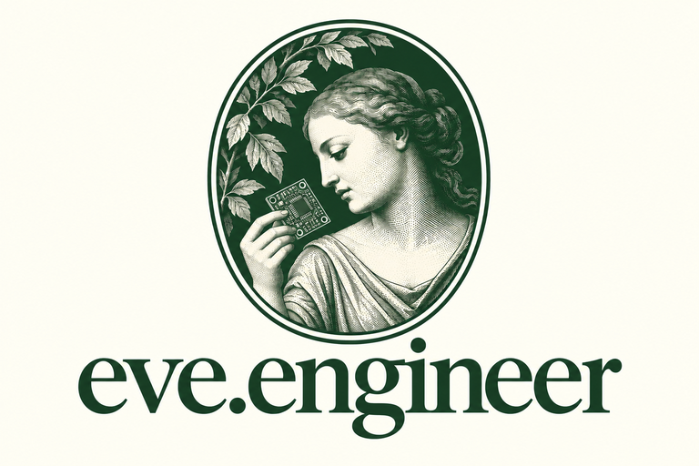

# Eve

<p align="center">
  <picture>
    <source media="(prefers-color-scheme: dark)" srcset="assets/branding/logo/eve-logo-dark-768.png">
    <source media="(prefers-color-scheme: light)" srcset="assets/branding/logo/eve-logo-light-768.png">
    
  </picture>
</p>

**She took the knowledge. Then she shared it with everyone.**

Open-source, Linux-native AI engineering for KiCad.

Eve is being built to help engineers design, analyze, modify, verify, and iterate
on real electronic hardware. She is model-agnostic, Git-native, and designed
around an engineer-in-the-loop philosophy:

**AI proposes and implements. Tools verify. Humans own the engineering decisions.
Physics gets the final vote.**

## Project status

This is the `0.1.0.dev0` foundation, not a finished autonomous design agent.
It provides working local tools for environment discovery, project inspection,
and recorded KiCad electrical/design rule checks. Model connections, MCP,
schematic editing, and PCB mutation are planned.

The first milestone is one reviewable loop: inspect a small existing design,
propose a bounded change, implement it in an isolated Git branch/worktree,
run KiCad checks, and present the diff and evidence for an engineer to accept.

## Try it on Linux

Requirements: Python 3.11+, Git for revision context, and KiCad 9+ for checks.
Initial live validation used KiCad 10.0.6 through Flatpak. Native `kicad-cli`
is preferred; Eve falls back to the `org.kicad.KiCad` Flatpak.

```sh
python3 -m venv .venv
.venv/bin/python -m pip install -e .
.venv/bin/eve doctor
.venv/bin/eve inspect /path/to/hardware-project
.venv/bin/eve check /path/to/hardware-project/main.kicad_sch \
  --project-root /path/to/hardware-project
.venv/bin/eve check /path/to/hardware-project/main.kicad_pcb \
  --project-root /path/to/hardware-project
```

The core has no third-party runtime Python dependencies. Run directly from
this checkout without installing packages:

```sh
PYTHONPATH=src python3 -m eve doctor
PYTHONPATH=src python3 -m eve inspect .
PYTHONPATH=src python3 -m eve check tests/fixtures/outlined.kicad_pcb
```

Commands return JSON. `doctor` reports executable discovery and host IPC binding
availability; it does not establish an IPC connection. Use `--backend native`
or `--backend flatpak` with `doctor`/`check` to choose explicitly. Flatpak must
already have access to the project and output directory; Eve does not change
sandbox permissions. Checks have a 120-second timeout, adjustable with `--timeout`.

## Inspectable verification

`check` chooses ERC for `.kicad_sch` and DRC for `.kicad_pcb`. Each run creates
`<project-root>/.eve/runs/<id>/` containing:

- `report.json`: KiCad's original report, when the tool produces one.
- `manifest.json`: command, version, timestamps, process result, stdout/stderr,
  report hash, Git HEAD/status, and design input hashes before and after.

The project root defaults to the input file's directory. Pass it explicitly for
hierarchical schematics or designs spread across subdirectories. Add `.eve/` to
your hardware repository's `.gitignore`; retain selected evidence with a review.
Run directories are never reused or overwritten.

Exit codes: **0** check passed, **1** rule violations, **2** operational error or
changed inputs. Inspection works without Git and records unavailable context.
Dirty and unborn checkouts are recorded without cleanup, commits, or resets.

Checks request all severities and do not request board saving or zone refill.
Hashing captures KiCad design/library files and library tables under the project
root, excluding Git, artifacts, virtual environments, and dependency directories.
Symlinked design files are rejected. External libraries, environment variables,
GUI state, and non-KiCad assets are not captured; manifests are traceability
records rather than complete reproducible-build snapshots. Concurrent changes
to captured inputs invalidate the result.

A passing rules check is evidence about the saved design and configured rules.
It does not guarantee electrical correctness, manufacturability, thermal
performance, or safety. Review exclusions and rule settings in the raw report.
Schematic/PCB parity checking and copper-zone refill are not enabled yet.

## Small by design

```text
src/eve/
  cli.py           JSON command interface
  project.py       design inventory, hashes, Git context
  kicad.py         native/Flatpak subprocess adapter
  verification.py recorded ERC/DRC runs
docs/
  architecture.md v0.1 boundaries and next milestones
  reconnaissance.md integration research and local findings
  licensing.md    license decision and dependency review
tests/
  test_eve.py      behavior and failure-path tests
  test_live.py     optional installed-KiCad integration tests
  fixtures/       minimal original KiCad test designs
```

Models will use the same engineering tools as the CLI. Optional MCP transport
and provider adapters can be added without embedding a particular model SDK in
the core. Prefer the official IPC API for future PCB edits; retain the CLI for
headless checks. No web service, database, containers, or agent framework is
needed for the first milestone. See [architecture](docs/architecture.md) and
[integration research](docs/reconnaissance.md).

## Development

```sh
PYTHONPATH=src python3 -m unittest discover -s tests -v
EVE_LIVE_TESTS=1 PYTHONPATH=src python3 -m unittest discover -s tests -v
```

Live tests copy fixtures to a temporary directory under your home directory for
Flatpak access. They test passing DRC, failing DRC, passing ERC, and unchanged
design inputs. Fixtures exercise integration plumbing, not production circuits.
CI tests Linux package installation on Python 3.11 and 3.14.
See [CONTRIBUTING.md](CONTRIBUTING.md).

## License

Eve is **AGPL-3.0-only**; see [LICENSE](LICENSE). Commercial use is permitted
under its terms. Hardware projects do not acquire Eve's license merely by being
opened or checked with the tool.

The [dependency/license review](docs/licensing.md) records the decision.
No code from the investigated MCP implementations has been incorporated.

Project logo and icon downloads: [brand assets](assets/branding/README.md).
