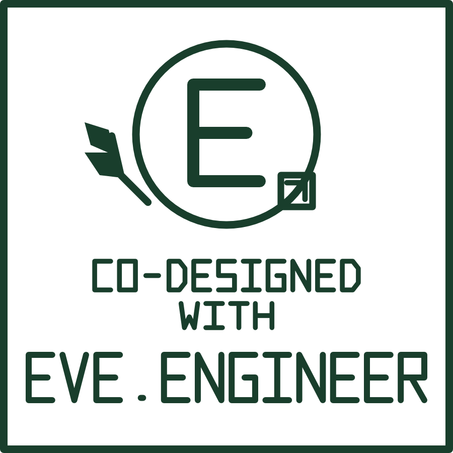

# Optional hardware attribution mark

**Attribution is appreciated where practicable, never required. Your designs
remain yours.** Suggested wording: **Co-designed with eve.engineer**.



This original single-color manufacturing mark complements the portrait logo
with an E, natural leaves, and a PCB motif. Its outer border is **exactly
15 × 15 mm**; it is centered at the origin in both CAD assets. It uses original
stroke lettering and requires no installed fonts.

## KiCad silkscreen

Add `kicad/Eve.pretty/` to your footprint library table, then place
`Eve_CoDesigned_15mm`. All visible artwork is filled vector geometry on
**F.SilkS**, with no pads, copper, mask openings, or board outline. Flip the
footprint normally for bottom silkscreen. Reference/value text is hidden.
The footprint is excluded from BOM and position-file exports.

The smallest nominal stroke is **0.16 mm**. Confirm your fabricator's minimum
silkscreen line/space requirements, keep the mark away from pads and exposed
copper, and inspect plotted fabrication output before ordering. Reducing
its size also reduces line widths and gaps.

## FreeCAD sketch and relief

Open `freecad/Eve_CoDesigned_15mm.FCStd`. It contains:

- `EveAttribution`: editable closed polylines on the XY plane, centered at the
  origin, with an exact 15 × 15 mm boundary. Geometry is intentionally
  unconstrained so it can be positioned/adapted in your design.
- `ReliefPreview`: a valid **0.5 mm** extrusion of the mark. This is a compound
  of separate raised solids, a preview rather than a finished attached feature.

Copy the sketch into your part's Body, position it on the intended face, and
use Pad for raised lettering or Pocket for recessed lettering. The disconnected
letter islands need a common supporting face to form one Part Design solid.
Choose feature height/depth and minimum detail for your manufacturing process;
0.5 mm is an example, not a validated production recommendation.

Alternatively run `freecad/CreateEveMark.FCMacro` to create a new document.
Keep the macro beside this directory's `geometry.json` as distributed. It does
not modify an existing document or save over your design.

## Vector source and rebuilding

`eve-co-designed-15mm.svg` is a physical-size vector source with outlined
lettering and no font dependency. `geometry.json` contains shared closed
contours in millimeters. `generate.py` rebuilds both and the KiCad footprint
using Shapely 2.x as a development-only dependency:

```sh
python3 assets/branding/hardware/generate.py
```

The FreeCAD macro consumes the same contours. KiCad polygons are fractured into
solid pieces to preserve holes. The files were validated with KiCad 10.0.6 and
FreeCAD 1.1.3, including footprint loading, dimensions, closed contours, and a
valid nonzero-volume relief. Manufacturing outcomes depend on the process.

## License

All files in this directory are **CC0-1.0**; see [LICENSE](LICENSE).
Use and adapt the artwork in private or commercial designs without attribution
or AGPL obligations. This does not grant trademark rights or imply endorsement.
The dedication applies to these original simplified marks, not the other
portrait logo assets or Eve's application.

Format references: [KiCad footprint graphics](https://dev-docs.kicad.org/en/file-formats/sexpr-intro/index.html)
and [FreeCAD geometry manual](https://www.freecad.org/manual/a-freecad-manual.pdf).
